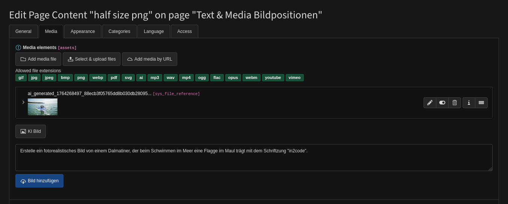

# Imager - AI generated images in TYPO3 with Google Gemini (Nano Banana)

## Introduction

This allows editors to generate AI-generated images directly in the TYPO3 backend. 
This works using Google Gemini (with Nano Banana).

Example photo from Gemini:


Example backend integration:


Example graphic in frontend:


## Google Gemini with Nano Banana

- To use the extension, you need a **Google Gemini API** key. You can register for one 
    at https://aistudio.google.com/app/api-keys.
- Look at https://ai.google.dev/gemini-api/docs/image-generation?hl=de#rest_22 for example prompts and to learn
    more about the power of Gemini image creation

## Installation

```
composer req in2code/imager
```

After that, you have to set some initial configuration in Extension Manager configuration:

| Title              | Default value                                                                      | Description                                                                                                                                          |
|--------------------|------------------------------------------------------------------------------------|------------------------------------------------------------------------------------------------------------------------------------------------------|
| promptPlaceholder  | LLL:EXT:imager/Resources/Private/Language/Backend/locallang.xlf:prompt.placeholder | LLL path to a label for placeholder for prompt field in backend                                                                                      |
| promptValue        | LLL:EXT:imager/Resources/Private/Language/Backend/locallang.xlf:prompt.value       | LLL path for a default value for prompt field in backend                                                                                             |
| promptPrefix       | -                                                                                  | Prefix text that should be always added to the prompt at the beginning                                                                               |
| combinedIdentifier | 1:/_imager/                                                                        | Define where to store new ai generated images                                                                                                        |
| aspectRatio        | 16:9                                                                               | Default ratio for new ai images. Must be one of this values: 1:1, 2:3, 3:2, 3:4, 4:3, 4:5, 5:4, 9:16, 16:9, 21:9                                     |
| model              | 3_pro_image_preview                                                                | Select a Gemini model (prices in Gemini may differ on different models)                                                                              |
| apiKey             | -                                                                                  | Google Gemini API key. You can let this value empty and simply use ENV_VAR "GOOGLE_API_KEY" instead if you want to use CI pipelines for this setting |

Note: It's recommended to use ENV vars for in2code/imager instead of saving the API-Key in Extension Manager configuration

```
GOOGLE_API_KEY=your_api_key_from_google
```

## Extendability

There are some events in EXT:imager that can be used to

- Decide to hide the button in backend (\In2code\Imager\Events\ButtonAllowedEvent::class)
- Manipulate or overrule the template of the rendered button in backend (\In2code\Imager\Events\TemplateButtonEvent::class)
- Manipulte the URL and request values before sending to Gemini (\In2code\Imager\Events\BeforeRequestEvent::class)

## Changelog and breaking changes

| Version | Date       | State   | Description                                                |
|---------|------------|---------|------------------------------------------------------------|
| 1.3.0   | 2025-12-04 | Feature | Add ddev as local environment                              |
| 1.2.0   | 2025-11-29 | Feature | Add event to manipulate the rendered button in the backend |
| 1.1.0   | 2025-11-27 | Task    | Add extension icon                                         |
| 1.0.0   | 2025-11-27 | Task    | Initial release of in2code/imager                          |


## Contribution with ddev

This repository provides a [DDEV]()-backed development environment. If DDEV is installed, simply run the following
commands to quickly set up a local environment with example usages:

* `ddev start`
* `ddev initialize`

**Backend Login:**
```
Username: admin
Password: admin
```

**Installation hint:**

1. Install ddev before, see: https://ddev.readthedocs.io/en/stable/#installation
2. Install git-lfs before, see: https://git-lfs.github.com/